# Projektseite des Arcarde Spiels

### [Übersicht über das Projekt](#1)
### [Erläuterung ausgewählter Klassen und Techniken](#2)

## Übersicht über das Projekt 

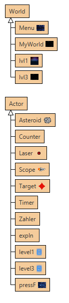

Unser Greenfoot-Projekt stellt ein kleines Arcade Spiel da, in dem es 2 verschiedene Spielmodi gibt.
Beim Start des Programms kommt man auf den Startscreen. Darauf steht: "PRESS F TO START". 

Wenn man dies ausführt wird man in dem Menüscreen geleitet, wo man sich für einen der beiden Spielmodi entscheiden kann. Sobald man einen der Modi anklickt startet der jeweilige Modus. 

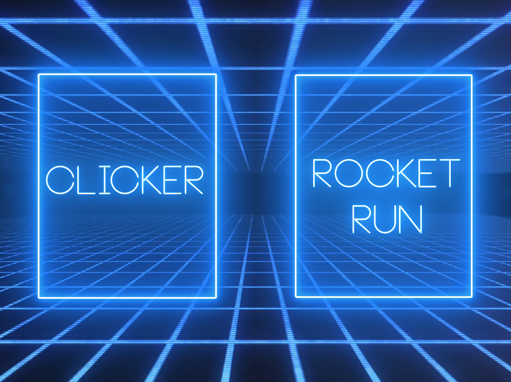

Das Clicker-Spiel beinhaltet ein Karo- Symbol, dass man anklicken muss. Sobald dies passiert ist, wird ein Punkt auf dem Scoreboard vermerkt und das Symbol  erscheint an einer zufälligen andern Position auf dem Bildschirm. Währenddessen läuft eine Zeit ab. Sobald die Zeit vorbei ist, kommt man in den Endscreen, wo einem seine erreichte Punktzahl angezeigt wird. Von da kommt man durch betätigen der Escape-Taste zurück in den Menüscreen. 

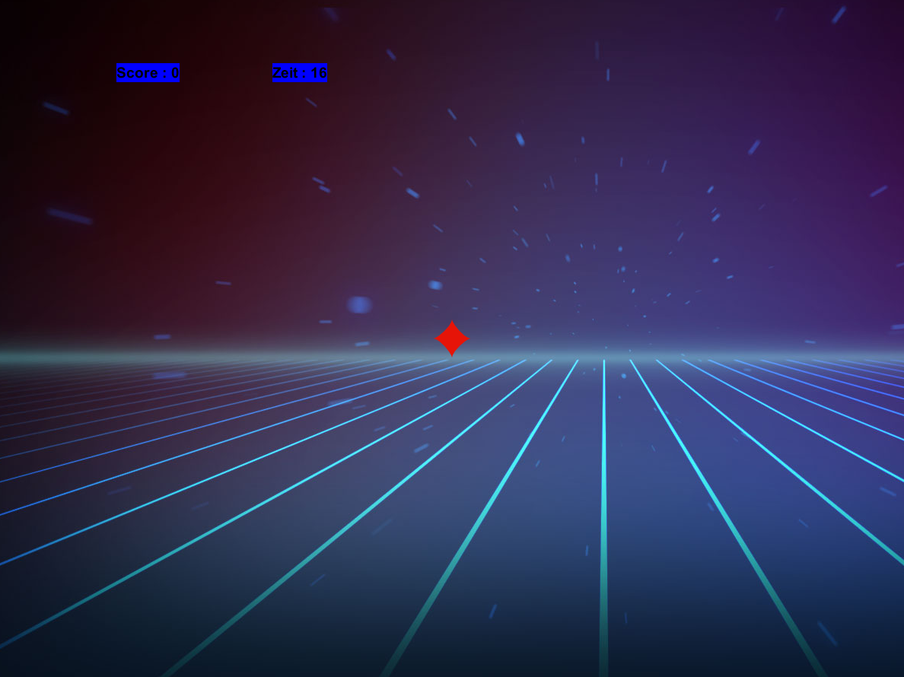

Im zweiten Modus: "Rocket Run" steuert man mit den W,A,S,D Tasten eine Rakete und muss versuchen heranfliegenden Meteoriten auszuweichen. Als Hilfe dazu diehnt eine eingebaute Schuss-Funktion. Diese wird durch betätigen der Enter-Taste ausgeführt. Die abgefeuerten Projektile zerstören jeweils den ersten Meteor des sie treffen. Das Spiel endet erst dann, wenn man mit der Rakete einen Meteor berüht. Punkte werden durch langes Überleben und durch zerstören von Meteoriten erhalten. Nach Ende der Patie werden einem die erreichten Punkte in der Mitte des Sceens angezeigt. Von dort kommt man ebenfalls durch betätigen der Escape-Taste zurück in den Menüscreen.

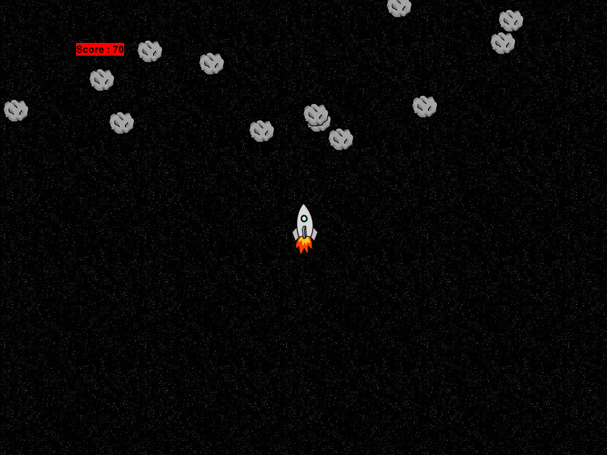
([zum Anfang](#0))

## Erläuterung ausgewählter Klassen und Techniken  
### [Navigation](#3)
### [Clicker](#4)
### [Rocket Run](#5)

### Navigation
Die Navigation durch die verschiedenen Ebenen unseres Programms wurde mit der setWorld Methode gelöst, bei der einfach die gewünschte Welt angezeigt wird, sowie auch die mit ihr verbundenen Actors. Hier ein Beispiel (in der public void Methode):

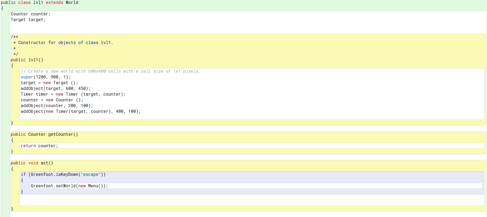

### Clicker
In diesem Spiel wird zum ersten Mal unser Timer und unser Counter programmiert. Der Timer wird hierbei von der Tickrate der Greenfootumgebung gesteuert, da jedes Mal, wenn die Methode ausgeführt wird, der Zeitwert um 1 verringert wird. Nun muss also nur noch das 60-fache der gewünschten Zeit als Startwert eingetragen werden.

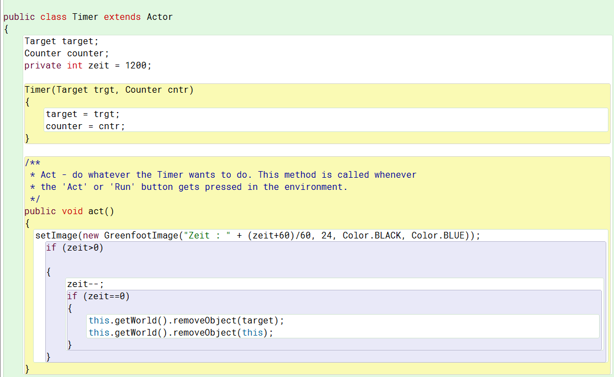

Der Counter nutzt die Möglichkeit öffentliche Methoden zu erstellen um so anderen Actors zu ermöglichen den Wert zu ändern bzw. zu erhöhen. Zudem wird durch die variable im Code eine dynamische Anzeige gewährleistet. Zudem verfügt der Counter ebenfalls über einen Timer, wodurch er nach Ablauf der Zeit den erspielten Endwert vergrößert darstellen kann.

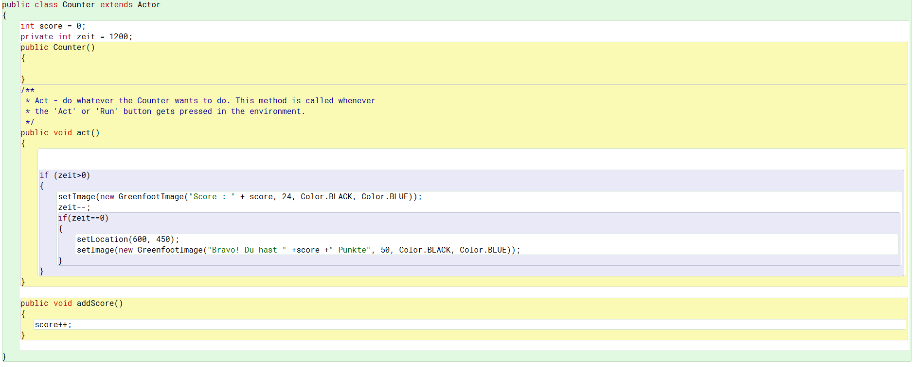

Das Ziel (hier Target) spielt in diesem Modus eine besondere Rolle, da es nicht nur für seine eigene Neupositionierung verantwortlich ist, sondern auch den Wert des Counters erhöhen muss, wenn man einen Treffer landet. Dafür bekommt es aus der Welt (lvl1) die nötigen Informationen, welche zuvor durch öffentliche Methoden zugänglich gemacht wurden, und kann so auf den Counter zugreifen.

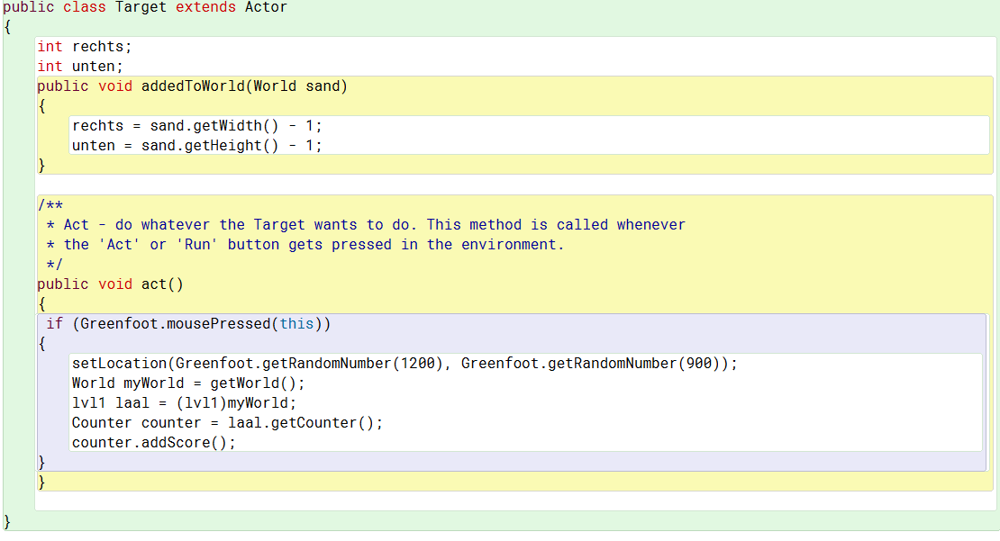
([zurück zur Erläuterung der Klassen und Techniken](#2))

### Rocket Run
In diesem Spiel werden neue Techniken verwendet um unter Anderem zufällig Asteroiden mit der gleiche Bewegungsrichtung und Geschwindigkeit, sowie ein Schusssystem und die Explosionsanimation zu implementieren. 

Das grundlegende Steuersystem der Rakete ist sehr simpel und beschränkt sich auf die 4 Himmelsrichtungen und eine Schussfunktion. Zudem wird die Rakete bei der Kollision mit einem Asteroiden zerstört und das Spiel damit beendet. 

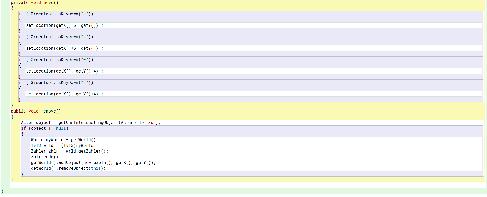

Um die Asteroiden an zufälligen Positionen erscheinen zu lassen und gleichzeitig eine geregelte Menge an Asteroiden zu erschaffen, wird hier den Zufallszahlengenerator verwendet um eine Chance für die Erschaffung eine Asteroiden 60-mal in der Sekunde zu generieren und zudem einen zufälligen X-Wert für seinen Erscheinungsort zu generieren.

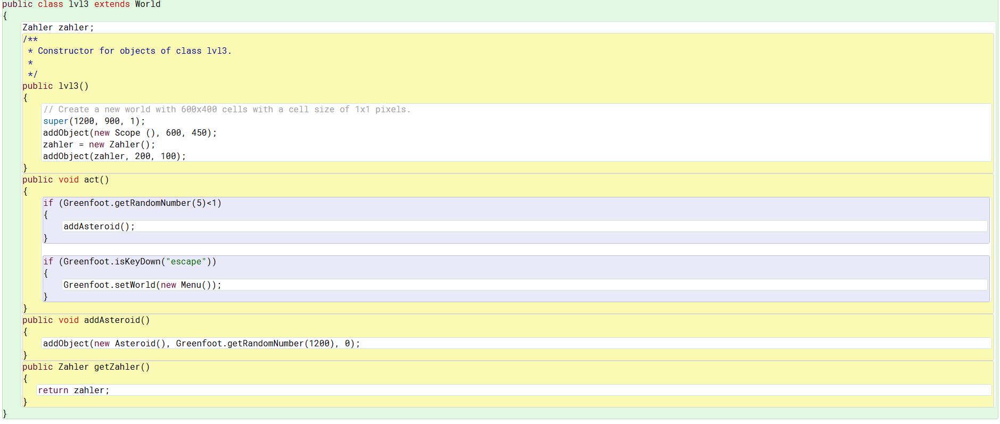

Der Asteroid hat dabei immer den gleichen Code: 

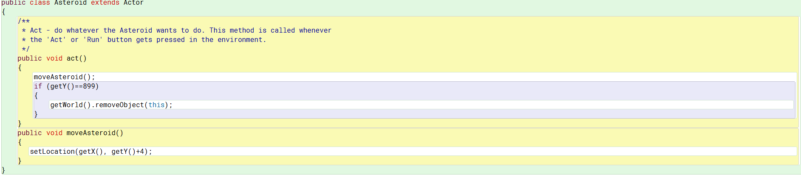

Das Schusssystem erstreckte sich zunächst über 2 Actor Klassen, später mit dem Hinzufügen eines Punktezählers dann über 3. Beim betätigen der Enter-Taste wird die Koordinate des Raumschiffs als Koordinate (mit zum Bild passender Abweichung) für den Schuss verwendet, welcher dann mit einer festgelegten Geschwindigkeit in Richtung der Asteroiden fliegt. Um eine übermäßige Nutzung dieser Fähigkeit zu vermeiden, wird wieder die Timer-Methode verwendet und ein Cooldown für das Abfeuern des Lasers gesetzt. 

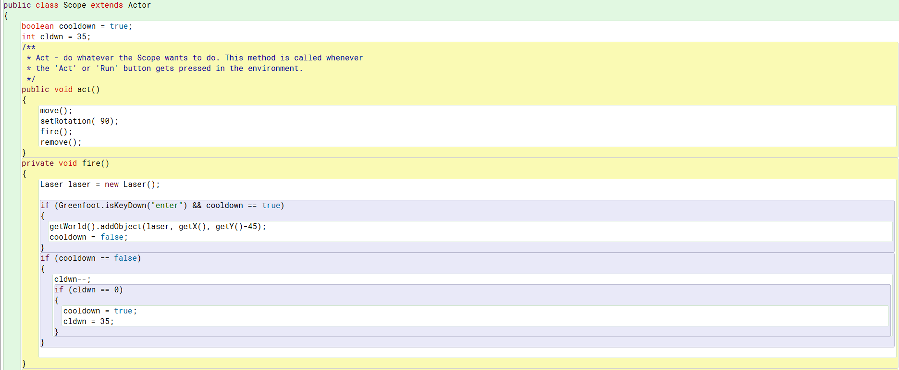

Damit der Laser beim Einschlag sich und das Ziel wie gewünscht zerstört, wird die Intersect Methode verwendet, welche nach Kollisionen mit der angegebenen Klasse sucht. Zudem verschwindet der Schuss nach dem Verlassen des Spielbereiches (Y-Koordinate == 0. 

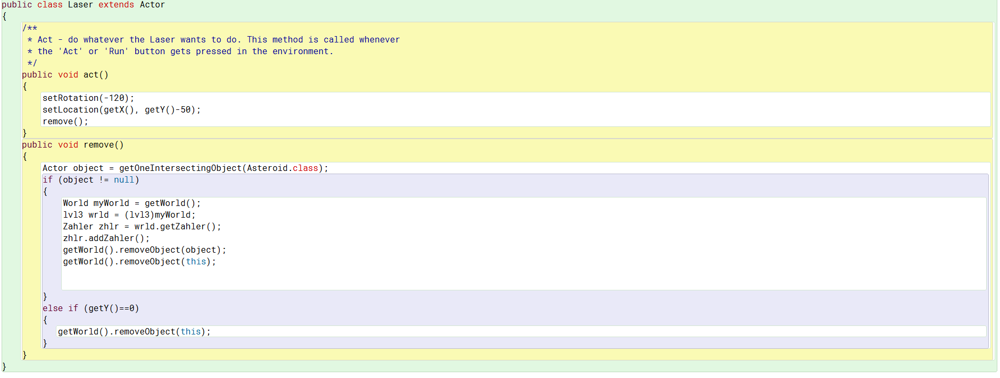

Das Zählsystem wurde dieses Mal mit einer neuen Komponente ausgestattet, da es nur so lange aktiv sein darf, wie auch der Spieler es ist. Zu diesem Grund wurde mit der Explosion des Raumschiffes auch der Zähler gestoppt, welcher den dafür erforderlichen Befehl in einer öffentlichen Methode gespeichert hat, welcher dann von der Rakete ausgefüht werden kann. Man erhält pro Sekunde 60 Punke und für die Zerstörung eines Asteroiden ebenfalls 60 Punkte.

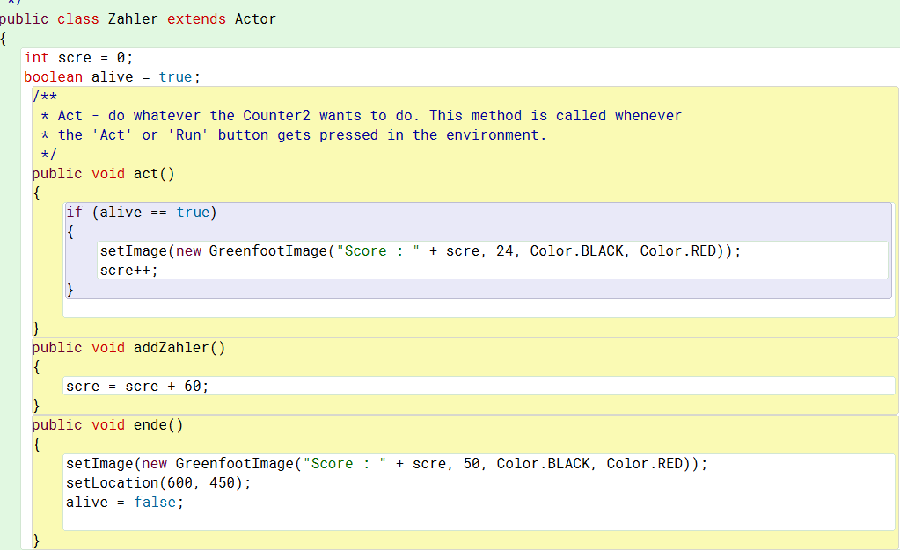

Die bei der Zerstörung der Rakete entstehende Explosion wird erneut mit Hilfe der Tickrate der Greenfootumgebung dargestellt. So wird die Animation in 60 Bilder pro Sekunde zerteilt und dann die Bilder einzeln angezeigt, wobei sich das angezeigte Bild 60-mal pro Sekunde ändert. So wird eine Animation mit 60 FPS erzeugt.

Das grundlegende Steuersystem der Rakete ist sehr simpel und beschränkt sich auf die 4 Himmelsrichtungen und eine Schussfunktion. Zudem wird die Rakete bei der Kollision mit einem Asteroiden zerstört und das Spiel damit beendet. 

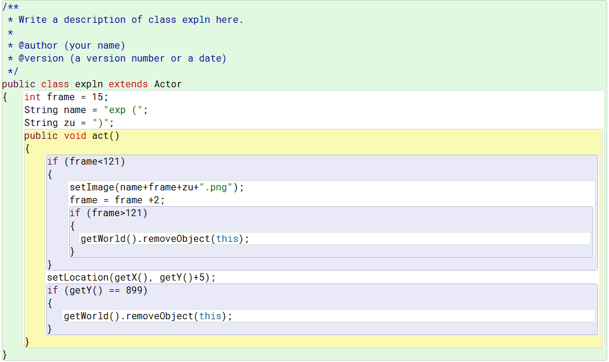
