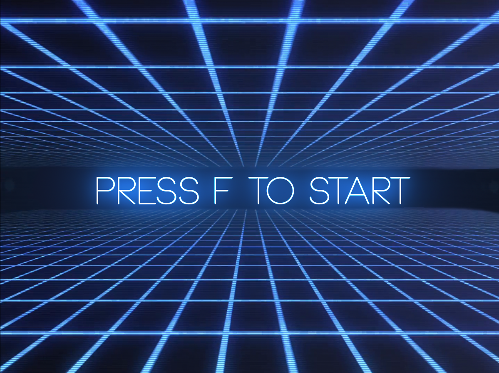

# Projektseite des Arcarde Spiels

### [Übersicht über das Projekt](#1)
### [Erläuterung ausgewählter Klassen und Techniken](#2)

## Übersicht über das Projekt 

Unser Greenfoot-Projekt stell ein kleines Arcade Spiel da, in dem es 2 verschiedene Spielmodi gibt.
Beim Start des Programms kommt man auf den Startscreen. Darauf steht: "press F to start". 

Wenn man dies ausführt wird man in dem Menüscreen geleitet, wo man sich für einen der beiden Spielmodi entscheiden kann. Sobald man einen der Modi anklickt startet der jeweilige Modus. 

Das Clicker-Spiel beinhaltet ein Karo- Symbol, dass man anklicken muss. Sobald dies passiert ist, wird ein Punkt auf dem Scoreboard vermerkt und das Symbol  erscheint an einer zufälligen andern Position auf dem Bildschirm. Währenddessen läuft eine Zeit ab. Sobald die Zeit vorbei ist, kommt man in den Endscreen, wo einem seine erreichte Punktzahl angezeigt wird. Von da kommt man durch betätigen der Escape-Taste zurück in den Menüscreen. 

Im zweiten Modus: "Rocket Run" steuert man mit den W,A,S,D Tasten eine Rackete und muss versuchen heranfliegenden Meteoriten auszuweichen. Als Hilfe dazu diehnt eine eingebaute Schuss-Funktion. Diese wird durch betätigen der Enter-Taste ausgeführt. Die abgefeuerten Projektile zerstören jeweils den ersten Meteor des sie treffen. Das Spiel endet erst dann, wenn man mit der Rakete einen Meteor berüht. Punkte werden durch langes Überleben und durch zerstören von Meteoriten erhalten. Nach Ende der Patie werden einem die erreichten Punkte in der Mitte des Sceens angezeigt. Von dort kommt man ebenfalls durch betätigen der Escape-Taste zurück in den Menüscreen.

## Erläuterung ausgewählter Klassen und Techniken

